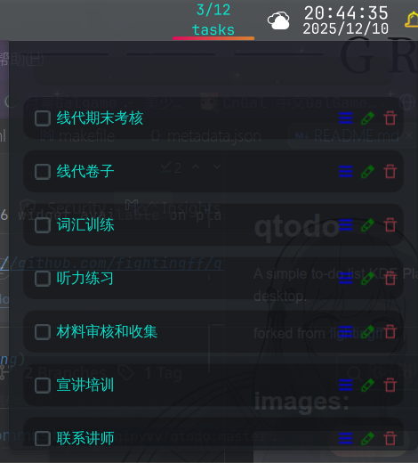

# qtodo

A simple to-do list KDE Plasma 6 widget,available on plasma panel or desktop.

forked from [fightingff](https://github.com/fightingff/qtodo)

## New Features:

- Adjustable font and font color 
- Adjustable background color and transparency
- Available on both panel and desktop
- Give you a smile when you complete all tasks! ＼(≧▽≦)／

## Installation:

```bash
git clone https://github.com/cmachsocket/qtodo.git
cd qtodo
make install # use 'make clean' to uninstall
```
or you can copy the folder to `~/.local/share/plasma/plasmoids/` manually.


## Images:



